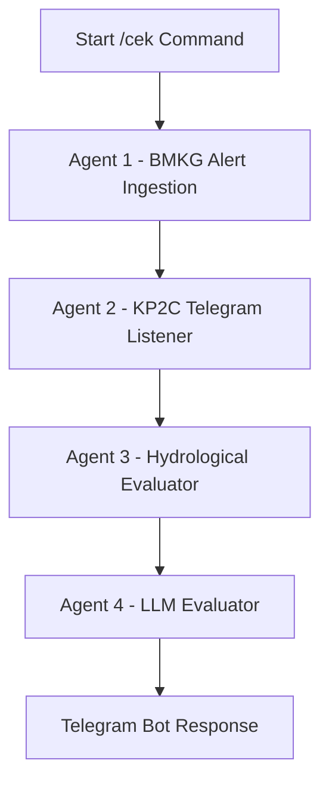

# 🌊 Bekasi Flood Early Warning System (Multi-Agent System)

Sistem Peringatan Dini Banjir berbasis **Multi-Agent System (MAS)** untuk wilayah aliran sungai Cileungsi-Cikeas-Bekasi. Sistem ini mengagregasi data *real-time* dari berbagai sumber resmi, memprosesnya secara terdistribusi menggunakan **LangGraph**, dan menyajikan evaluasi risiko beserta **Audit Log Transparan** langsung via **Telegram Bot**.

---

## 🏗️ Arsitektur Multi-Agent System (MAS)

Sistem ini terdiri dari 4 Agen Mandiri yang bekerja secara sekuensial:



1. **Agent 1 (BMKG Alert Ingestion)**: Mengambil data peringatan dini cuaca ekstrem dari API/XML resmi BMKG khusus wilayah hulu dan hilir (Cileungsi, Cikeas, Bekasi).
2. **Agent 2 (KP2C Telegram Listener)**: Mengekstrak laporan Tinggi Muka Air (TMA) secara *live* dari saluran resmi Telegram KP2C menggunakan Telethon.
3. **Agent 3 (Hydrological Evaluator)**: Membedah data TMA real-time jam terakhir, menghitung estimasi waktu tempuh air ke pemukiman warga, dan menerapkan logika deterministik risiko banjir BPBD.
4. **Agent 4 (LLM Evaluator & Prompt Engine)**: Menyusun narasi laporan kebencanaan yang menenangkan dan informatif menggunakan **Vikey API** (`gemini/gemini-3.8-flash`) lengkap dengan proteksi *fallback template*.

---

## 🛠️ Tech Stack & Environment

* **Core Framework**: Python 3.13+, LangGraph, LangChain Core
* **LLM Engine**: Vikey API (`gemini/gemini-3.8-flash`) via OpenAI-Compatible Wrapper
* **Data Sources**: Telethon (Telegram KP2C), BMKG XML/JSON API
* **Interface**: `python-telegram-bot`
* **Execution Environment**: Dual-Environment (Linux Fedora PC & Termux Android with `termux-wake-lock`)

---

## 📂 Struktur Direktori

```text
bekasi-flood-mas/
├── agents/
│   ├── agent_bmkg.py        # Agent 1: Scraper & Parser Data BMKG
│   ├── agent_social.py      # Agent 2: Telethon Data Extraction dari KP2C
│   ├── agent_tma.py	     # Agent 3: Kalkulasi TMA & Logika Hidrologi
│   └── agent_evaluator.py   # Agent 4: LLM Narration & Risk Decision
├── bot_server.py            # Main Listener Telegram Bot + Audit Log Viewer
├── main.py                  # CLI Workflow Tester
├── state.py                 # LangGraph Shared State Schema
├── .env.example             # Template Environment Variables
├── requirements.txt         # Minimal & Clean Dependencies
└── README.md                # Dokumentasi Project
```

---

## 🚀 Cara Menjalankan

### 1. Cloning & Persiapan Environment
```bash
git clone https://github.com/fahreza-beep/bekasi-flood-mas.git
cd bekasi-flood-mas
python -m venv venv
source venv/bin/activate
pip install -r requirements.txt
```

### 2. Konfigurasi Environment Variables
Buat file `.env` berdasarkan `.env.example`:
```env
VIKEY_API_KEY=your_vikey_api_key
VIKEY_API_BASE=https://api.vikey.ai/v1
TELEGRAM_BOT_TOKEN=your_telegram_bot_token
TELEGRAM_API_ID=your_telethon_api_id
TELEGRAM_API_HASH=your_telethon_api_hash
```

### 3. Menjalankan Bot
* **Di PC / Server**:
  ```bash
  python bot_server.py
  ```
* **Di Termux Android (Background Uptime)**:
  ```bash
  termux-wake-lock
  python bot_server.py
  ```

---

## 📊 Fitur Unggulan: Audit Log Transparan

Sistem menyajikan **Raw Data Audit** transparan dari setiap agen sebelum laporan akhir ditampilkan, sehingga *stakeholder* dan masyarakat dapat memverifikasi keabsahan data mentah dari BMKG dan KP2C secara akuntabel.
